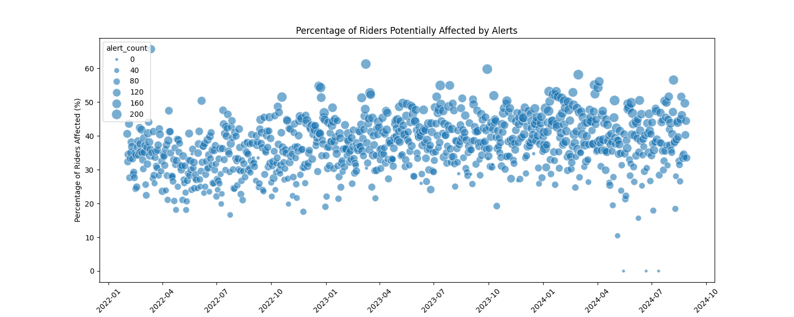
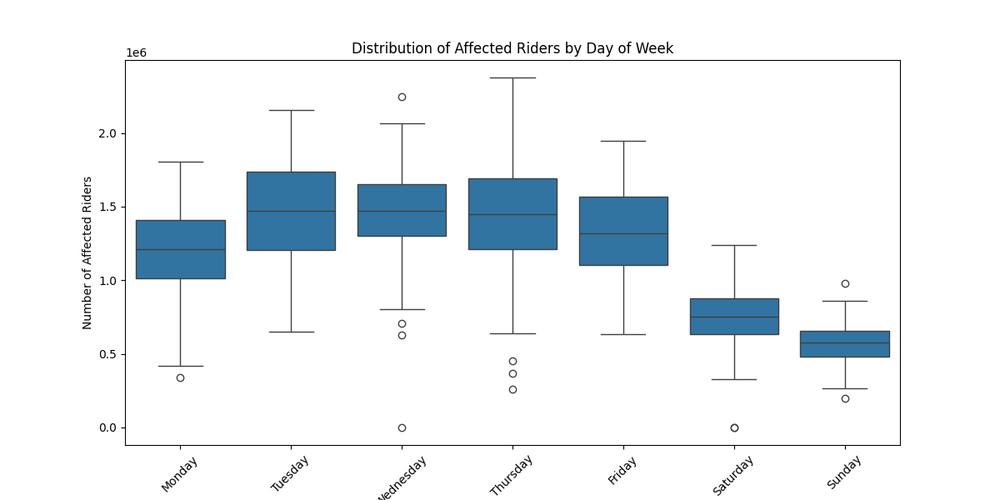
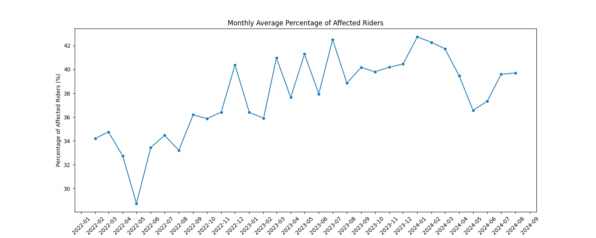
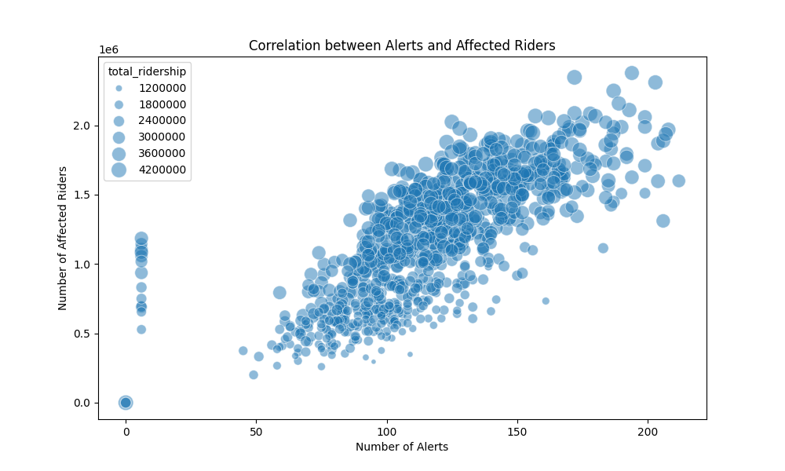

# Preliminary Data Analysis

This directory contains visualizations analyzing the relationship between MTA service alerts and ridership patterns from February 2022 through August 2024. The analysis focuses on quantifying how many riders are potentially affected by service disruptions.

## Visualizations

### 1. Percentage Impact of Alerts

This scatter plot shows the daily percentage of total riders potentially affected by service alerts. Each point represents a day, with the size of the point indicating the number of alerts on that day. This visualization helps identify days with unusually high impact relative to ridership.

### 2. Weekly Distribution of Affected Riders

This box plot displays the distribution of affected riders across different days of the week. The boxes show:

- Median number of affected riders
- Interquartile range (25th to 75th percentile)
- Outliers for each day

This helps identify patterns in service disruption impacts across different days of the week.

### 3. Monthly Average Impact

This line plot tracks the monthly average percentage of riders potentially affected by service alerts. The trend line helps identify:

- Seasonal patterns
- Long-term trends in service disruption impacts
- Months with unusually high or low impact

### 4. Alert Impact Correlation

This scatter plot examines the relationship between:

- Number of daily alerts (x-axis)
- Number of potentially affected riders (y-axis)
- Total daily ridership (point size)

This visualization helps understand whether more alerts consistently lead to more affected riders, and how this relationship varies with overall ridership volume.

## Methodology Note

The "affected riders" metric represents an upper bound estimate, counting riders who:

- Entered stations serving disrupted lines
- Entered within 30 minutes of a relevant service alert

The actual number of affected riders is likely lower, as not all stops along a disrupted line are necessarily affected by each incident.
